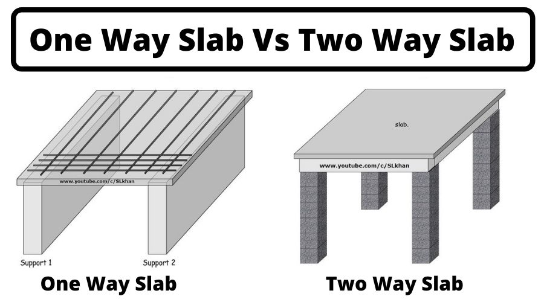

### One-way Slab:

- One-way slabs are structural elements commonly used in building construction to support loads
primarily in one direction, usually spanning between beams or walls.
- The design of one-way slabs involves determining the slab thickness, reinforcement layout, and other
parameters to ensure the slab can safely carry anticipated loads without exceeding allowable
deflections or stresses.
- The design process typically begins with determining the design loads including dead load, live load,
and other applicable loads as per relevant building codes and standards.
- Bending moments and shear forces are then calculated based on the applied loads and slab
geometry. These are essential for sizing the slab thickness and selecting appropriate reinforcement.
- Reinforcement in one-way slabs is primarily provided in the form of reinforcing bars (rebars) placed
in the tension zone to resist bending moments. The amount and spacing of reinforcement are
determined based on the calculated bending moments and applicable design codes.
- Shear reinforcement may also be necessary to resist shear forces, especially near supports or
openings.
- After determining the reinforcement layout, it is essential to check the deflection criteria to ensure
serviceability requirements are met.
- The design is then validated through structural analysis, either using software tools like ETABS,
SAP2000, or manual calculations following established design procedures.
### Two-way Slab:
-A rectangular slab supported on four sides, and experiencing two-way bending: where transverse
loads span in both directions, perpendicular to all supporting edges. The load is distributed evenly,
resembling a dish or saucer, transferring the load to the supports and deflecting in both directions.

-Deflection Profile: In the case of a two-way slab, the deflection profile resembles that of a dish or
saucer, as observed from the slab behavior described above. The deflection contours obtain from
these surfaces These contours display varying shapes, closely spaced in certain areas, indicating
steeper curvature in the shorter direction due to the concentration of bending moments, while being
more widely spaced in the longer direction. This observation simplifies that larger moments lead to
proportional curvatures, resulting in a more pronounced variation of slopes along the shorter span
direction compared to the longer span direction. Therefore, provisions for main steel reinforcement
are necessary in both directions to accommodate bending moments of comparable magnitude. The
determination of bending moments mx and my in two directions has been elaborated upon in the
analysis of two-way bending moments.